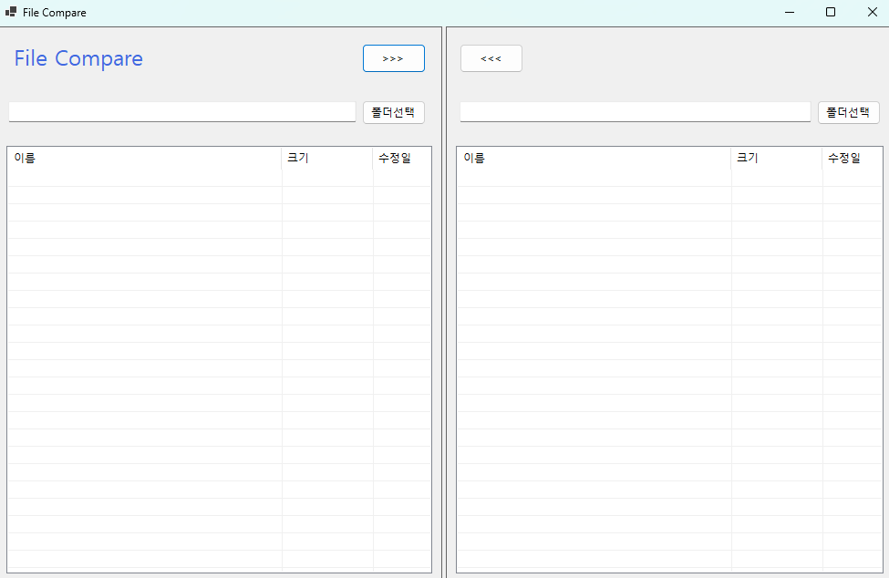
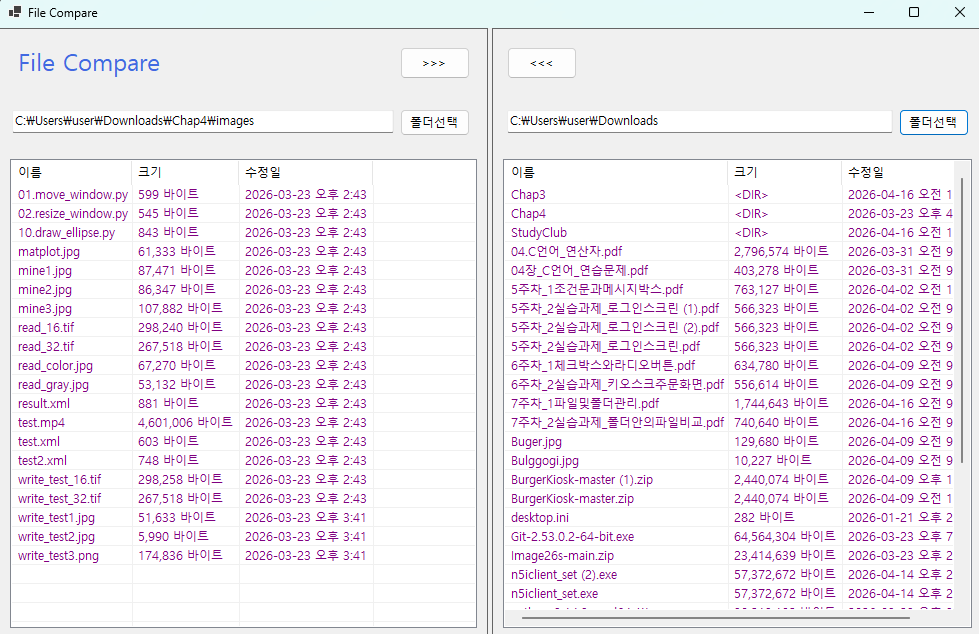
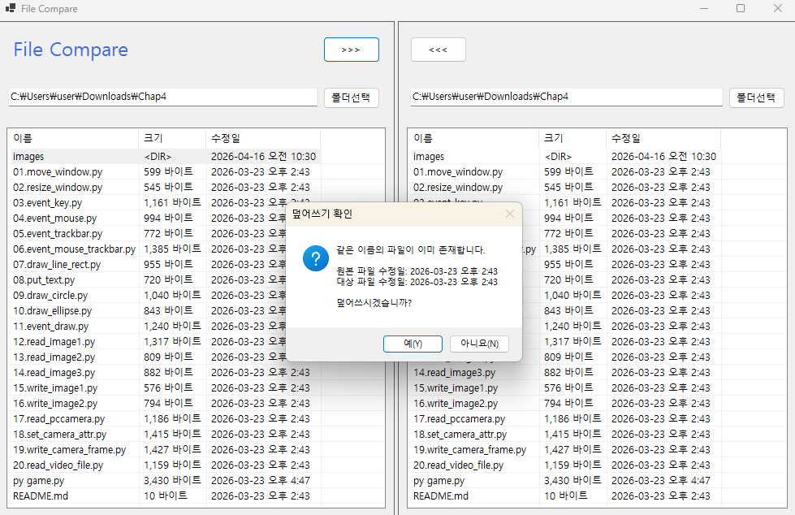
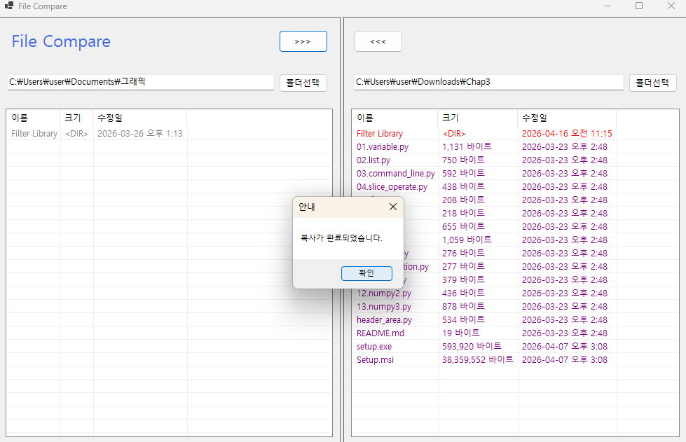
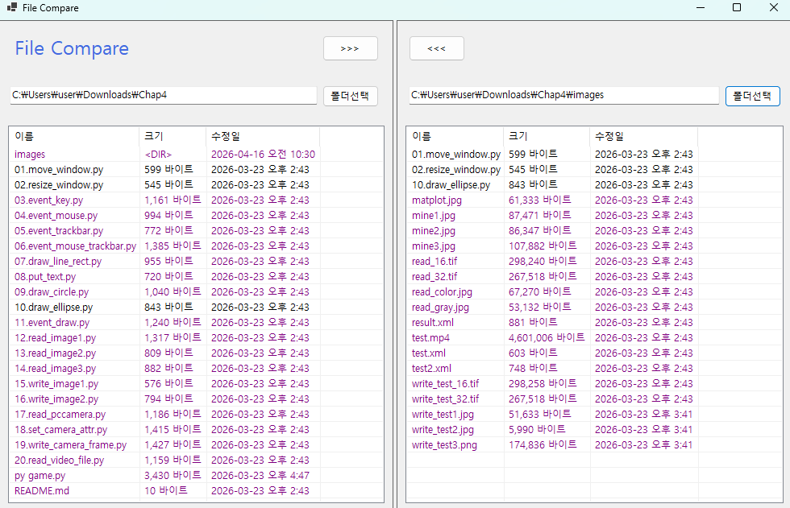

# FileCompare

# (C# 코딩) FileCompare

## 개요
- C# 프로그래밍 학습
- 1줄 소개: 두 폴더 간의 파일과 하위 폴더를 비교하고 선택한 항목을 상호 복사할 수 있는 파일 관리 프로그램
- 사용한 플랫폼:
  - C#, .NET Windows Forms, Visual Studio, GitHub
- 사용한 컨트롤:
  - 입력: Button (폴더 선택, 복사 방향 버튼), TextBox (폴더 경로 표시)
  - 출력: ListView (파일 목록 표시 - 이름, 크기, 수정일), Label (프로그램 이름 표시)
  - 컨테이너: SplitContainer (좌우 폴더 영역 구분), Panel
- 사용한 기술과 구현한 기능:
  - FolderBrowserDialog를 이용한 로컬 디렉토리 선택 기능 구현
  - Directory.EnumerateDirectories, EnumerateFiles를 활용한 파일 및 폴더 목록 출력
  - FileInfo, DirectoryInfo 클래스를 사용하여 파일 크기 및 수정일 정보 처리
  - ListView의 Details 모드 및 컬럼 구성을 통해 표 형태 UI 구성
  - 파일 및 폴더를 이름 기준으로 비교하고 수정시간을 기준으로 색상 표시
  - 동일 항목(검정), 최신 항목(빨강), 오래된 항목(회색), 단독 항목(보라)으로 구분
  - File.Copy 메서드를 이용한 파일 복사 기능 구현하기
  - 동일 파일 존재 시 수정일 비교 후 덮어쓰기 여부 확인창 구현
  - 재귀 호출을 이용하여 하위 폴더까지 포함한 복사 기능 구현 (과제4)

## 실행 화면 (과제1)
- 과제1 코드의 실행 스크린샷 
- 
  
  
- 과제 내용
  - SplitContainer를 활용하여 화면을 좌우로 분할하고 파일 비교 프로그램의 기본 사용자 인터페이스를 구성하는 것이 목표이다. 각 영역에는 폴더 경로를 표시할 TextBox와 폴더 선택 버튼을 배치하고 파일 목록을 출력할 ListView를 추가하여 이후 기능 구현을 위한 기반 구조를 설계하였다. 또한 파일 복사 기능을 고려하여 방향 버튼을 배치하고 전체적인 UI의 균형과 가독성을 고려하여 초기 화면을 구성하였다.

- 구현 내용과 기능 설명
  - SplitContainer를 사용하여 화면을 좌우로 나누고 각 영역에 Panel을 배치하여 구조를 정리하였다. Label을 통해 프로그램 이름을 표시하고 TextBox를 이용해 폴더 경로를 출력하도록 구성하였다. ListView를 Details 모드로 설정하고 이름, 크기, 수정일 컬럼을 추가하여 파일 정보를 표 형태로 표시할 수 있도록 하였다. 또한 프로그램 실행 시 아무 항목도 선택되지 않도록 초기 상태를 설정하여 사용자 인터페이스의 완성도를 높였다.

## 실행 화면 (과제2)
- 과제2 코드의 실행 스크린샷 
- 
  
  
- 과제 내용
  - 사용자가 버튼을 통해 원하는 폴더를 선택하고 해당 폴더 내부의 파일 및 하위 폴더 목록을 화면에 출력하는 기능을 구현하는 것이 목표이다. 또한 선택된 두 폴더의 내용을 비교하여 동일한 이름의 파일을 기준으로 수정시간을 비교하고 그 결과를 색상으로 구분하여 사용자에게 직관적으로 보여주는 기능을 포함한다.

- 구현 내용과 기능 설명
  - FolderBrowserDialog를 사용하여 사용자가 폴더를 선택할 수 있도록 구현하고 선택된 경로를 TextBox에 출력하였다. Directory.EnumerateDirectories와 EnumerateFiles를 이용하여 하위 폴더와 파일 목록을 가져와 ListView에 표시하였다. 또한 파일 이름을 기준으로 양쪽 데이터를 비교하고 수정시간을 기준으로 색상을 변경하여 동일 파일, 최신 파일, 오래된 파일을 구분할 수 있도록 구현하였다.

## 실행 화면 (과제3)
- 과제3 코드의 실행 스크린샷 
- 
  
- 
- 
  
  
- 과제 내용
  - 사용자가 선택한 파일을 반대편 폴더로 복사할 수 있는 기능을 구현하는 것이 목표이다. 또한 동일한 이름의 파일이 대상 폴더에 존재하는 경우 덮어쓰기 여부를 사용자에게 확인받도록 하여 데이터 손실을 방지하는 기능을 포함한다. 이를 통해 파일 관리 프로그램의 기본적인 복사 기능을 완성한다.

- 구현 내용과 기능 설명
  - 선택된 ListViewItem을 기준으로 원본 파일 경로와 대상 파일 경로를 생성하였다. File.Exists를 사용하여 동일 파일 존재 여부를 확인하고 FileInfo를 통해 수정일 정보를 비교하였다. 이후 MessageBox를 통해 사용자에게 덮어쓰기 여부를 확인받도록 구현하였다. 복사 완료 후에는 ListView를 다시 갱신하여 변경된 내용이 즉시 반영되도록 하여 프로그램의 동작 흐름을 자연스럽게 만들었다.

## 실행 화면 (과제4)
- 과제4 코드의 실행 스크린샷 
- 
  
  
- 과제 내용
  - 기존 파일 복사 기능을 확장하여 하위 폴더까지 포함한 전체 구조 복사 기능을 구현하는 것이 목표이다. 폴더를 선택했을 경우 내부 파일뿐만 아니라 하위 폴더까지 모두 포함하여 복사되도록 하고, 이를 통해 실제 파일 탐색기와 유사한 수준의 기능을 구현하는 것을 목표로 한다.

- 구현 내용과 기능 설명
  - 재귀 함수를 이용하여 선택된 폴더 내부의 파일과 하위 폴더를 순차적으로 탐색하고 복사하도록 구현하였다. Directory.CreateDirectory를 사용하여 대상 경로에 폴더를 자동으로 생성하고 파일은 CopyFileWithConfirmation 함수를 통해 복사하였다. 복사 과정에서 일부 파일이 취소되거나 실패할 경우 전체 완료가 아닌 부분 완료 메시지를 출력하도록 개선하여 사용자에게 정확한 상태를 전달하도록 하였다.